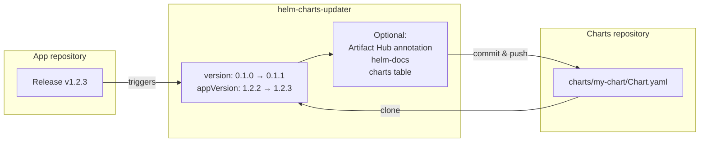

<div align="center">

# helm-charts-updater

A GitHub Action that bumps a Helm chart in your charts repository when you release your app

[](https://github.com/shini4i/helm-charts-updater/actions/workflows/qa.yml)
[](https://codecov.io/gh/shini4i/helm-charts-updater)
[](https://github.com/shini4i/helm-charts-updater/releases/latest)
[](https://www.python.org/)
[](LICENSE)
[](https://github.com/shini4i/helm-charts-updater/commits/main)

</div>

## What It Does

You keep your Helm charts in one repository and your application code in another. When the
application is released, its chart has to be updated — a new `appVersion` and a new chart
`version`. This action does that update for you, from the application's release pipeline.

Given a chart name and a new app version, it:

1. Clones the charts repository.
2. Sets `appVersion` to the new version and bumps the chart `version` patch number.
3. Commits and pushes the change back.

Optionally it also writes an [Artifact Hub](https://artifacthub.io) changelog annotation,
regenerates the chart's README with [helm-docs](https://github.com/norwoodj/helm-docs), and
refreshes a table of all charts in the charts repository's README.

Nothing is committed if the chart already has the requested `appVersion`.



### Requirements

- The chart must use `appVersion` as its image tag, so bumping `appVersion` is enough to deploy
  the new release.
- The token passed as `github_token` must be allowed to push to the charts repository.

> [!WARNING]
> Only a patch bump of the chart `version` is supported.

Pairs well with [chart-releaser-action](https://github.com/helm/chart-releaser-action), which
packages and publishes the charts once this action has bumped them.

## Example Workflow

```yaml
- name: Update helm chart
  uses: shini4i/helm-charts-updater@v1
  with:
    github_token: ${{ secrets.GH_TOKEN }}
    gh_user: shini4i
    gh_repo: charts
    chart_name: my-chart
    app_version: ${{ github.ref_name }}

    # Optional. The path to clone the git repository
    # Defaults to charts-repo
    clone_path: charts-repo

    # Optional. Path to the location of helm charts in the gh_repo
    # Default to charts
    charts_path: charts

    # Optional. Git user.name
    # Defaults to github-actions[bot]
    commit_author: github-actions[bot]

    # Optional. Git user.email
    # Defaults to github-actions[bot]@users.noreply.github.com
    commit_email: github-actions[bot]@users.noreply.github.com

    # Optional. Whether helm docs should be generated for the selected chart.
    # Defaults to true
    generate_docs: true

    # Optional. Whether the README should be updated with the table of existing charts.
    # Defaults to false
    # NOTE: It is required to have the following comments in the README.md file:
    # <!-- table_start -->
    # <!-- table_end -->
    # The table would be generated between those two comments.
    update_readme: true

    # Optional. Whether the chart annotation should be updated.
    # Defaults to false
    # If will update the chart annotation with the updated appVersion
    # to generate changelog on the artifact hub.
    update_chart_annotations: true
```
